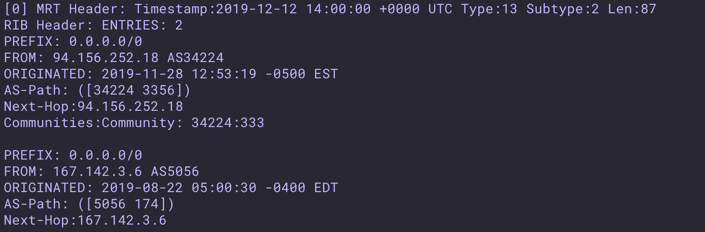
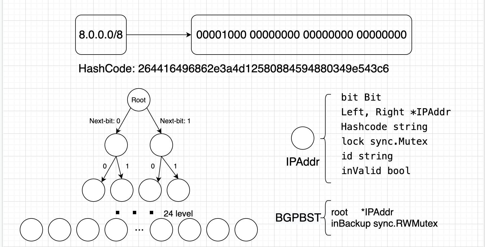

# BGPParser


- - - -

[](https://travis-ci.com/import-yuefeng/BGPParser)
[](https://godoc.org/github.com/import-yuefeng/BGPParser)
[](https://goreportcard.com/report/github.com/import-yuefeng/BGPParser)

**由于 BGPParser 还在开发的早期，请暂时不要将 BGPParser 用于生产环境！**

BGPParser 是基于 Go 实现的 BGP 数据分析工具

**请注意: 本 Readme 仅仅确保 master 分支正确，如若使用版本差距较大的 Binary 版本，请注意检查 Release 说明.**

## 功能和未来展望
+ 支持 并发分析 BGP rib.bz2 数据 (二进制数据)

+ 支持 并发分析 由bgpdump 导出的 rib.txt 格式数据 (友好型数据)


* 支持 并发构造 IPTree 树，提供高效的 IP 段查询


* 支持 合并相似 IP 段数据，并据此构造 IPTree

更多技术细节请参考 [这里](bgpParser.pdf)

## 安装
我们提供跨平台多版本的 二进制程序可下载： [release](https://github.com/import-yuefeng/BGPParser/releases).

## Usages
使用默认配置文件 -> ./config.json
    $ ./parser 

需要使用其他指令，请使用帮助:
    $ ./parser -h

###  配置文件的语法

默认读取的配置文件名为: config.json :
```json
{
	nil:nil,
}
```

## 感谢
* Dependencies:
	* [grpc](google.golang.org/grpc): Apache-2.0 
	* [logrus](https://github.com/Sirupsen/logrus): MIT
	* [cobra](github.com/spf13/cobra): Apache-2.0 
	* [gobgpdump](github.com/CSUNetSec/gobgpdump): BSD 2-Clause “Simplified” License 
* Contributors: https://github.com/import-yuefeng/BGPParser/graphs/contributors

## 开源协议
This project is under the MIT license. See the [LICENSE](LICENSE) file for the full license text.